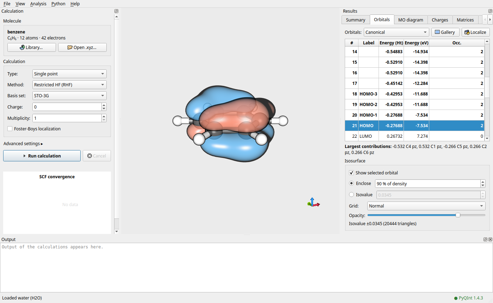
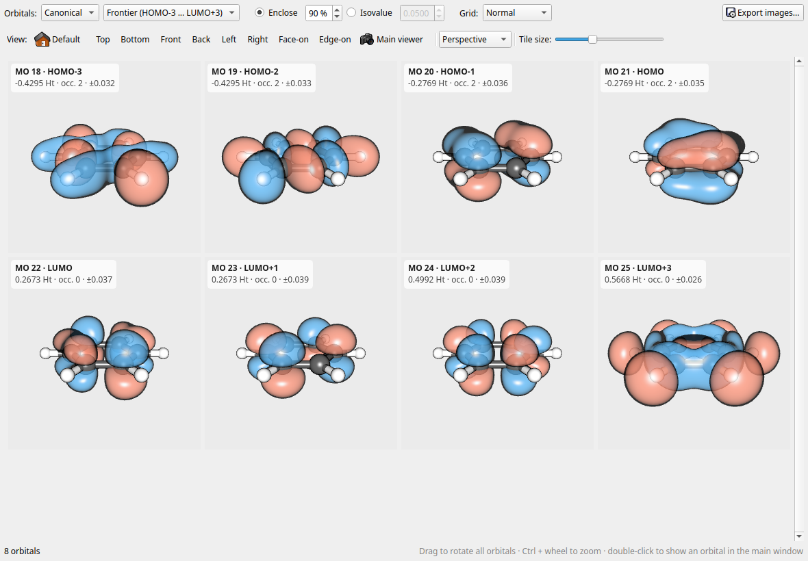
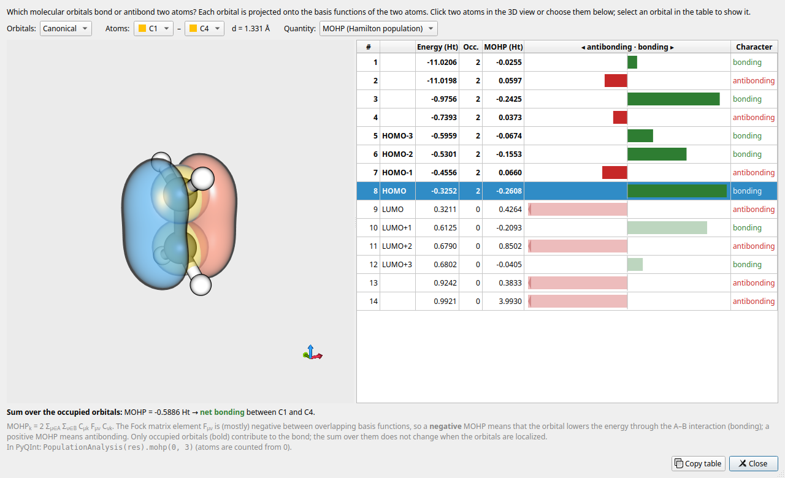

# PyQInt-GUI

Graphical user interface for [PyQInt](https://ifilot.github.io/pyqint/), an
educational Hartree-Fock program. PyQInt-GUI lets students set up and run
calculations without writing any Python, and visualizes molecules and
molecular orbitals in 3D.



| Orbital gallery | Orbital bonding analysis |
|-----------------|--------------------------|
|  |  |
| All orbitals side by side, rotated together; one PNG per orbital on export. | Which orbitals bond or antibond two atoms (here the C=C bond of ethylene)? |

## Features

* Molecules from a built-in library or from `.xyz` files
* Restricted and unrestricted Hartree-Fock single points (STO-3G ... aug-cc-pVQZ)
* Geometry optimization with an interactive trajectory viewer
* Foster-Boys localization of the occupied orbitals, either as part of the
  calculation or afterwards for an existing result (without repeating the
  Hartree-Fock calculation)
* Molecular-orbital isosurfaces (isovalue chosen automatically to enclose a
  given fraction of the density, or set manually)
* Orbital gallery: all (or a range of) orbitals in a grid that rotates as one,
  preset orientations (including face-on and edge-on views of planar
  molecules) and export of every orbital as a separate PNG image
* Orbital bonding analysis for any pair of atoms: orbital-resolved Hamilton
  (MOHP), overlap (MOOP) and bond-index (MOBI) populations, with the atoms
  highlighted in 3D
* MO energy-level diagram, Mulliken and Löwdin charges, and all intermediate
  matrices (S, T, V, H, X, F, P) with basis-function labels
* Live SCF convergence plot
* Stereoscopic rendering (anaglyph and interlaced), shared with
  [Managlyph](https://github.com/ifilot/managlyph)

## How it works

The installer contains only the program and a copy of
[uv](https://github.com/astral-sh/uv). On first launch PyQInt-GUI uses uv to
download a standalone Python interpreter and install the tested PyQInt
version in a private folder:

| Platform | Location                                                   |
|----------|------------------------------------------------------------|
| Windows  | `%LOCALAPPDATA%\IMC\PyQInt-GUI\python`                     |
| macOS    | `~/Library/Application Support/IMC/PyQInt-GUI/python`      |
| Linux    | `~/.local/share/IMC/PyQInt-GUI/python`                     |

Any Python installation already on the computer is left untouched. The
environment can be updated, reset or replaced by your own interpreter via
**Python → Manage environment**.

Every calculation runs in its own folder (**File → Show job folders**)
containing:

* `job.py`: a stand-alone script that uses only the public PyQInt API; run it
  with `python job.py` to reproduce the calculation outside of the GUI
* `pyqint_gui_export.py`: helper that writes the results and reports progress
* `result.json`: all results; open it again via **File → Open result**
* `output.log`: the complete output of the calculation
* `localize.py` and `localize.log`: only when the orbitals were localized
  afterwards (**Analysis → Localize orbitals**); the script rebuilds the
  Hartree-Fock result from `result.json` and adds the Foster-Boys orbitals to it

Molecular orbitals are evaluated on a grid by the GUI itself (in C++) from the
basis set and coefficients stored in `result.json`, so changing the isovalue
or grid resolution does not require running Python again. The same holds for
the bonding analysis, which uses the stored Fock, overlap and density matrices
and gives the same values as `pyqint.PopulationAnalysis`.

## Compilation

### Ubuntu / Debian

```bash
sudo apt install build-essential cmake ninja-build qt6-base-dev qt6-base-dev-tools libqt6opengl6-dev libglm-dev
cmake -S . -B build -G Ninja -DCMAKE_BUILD_TYPE=Release
cmake --build build
QT_QPA_PLATFORM=offscreen ctest --test-dir build --output-on-failure
```

For a development build, either place a `uv` executable next to `pyqint-gui`
(`scripts/fetch-uv.sh x86_64-unknown-linux-gnu build`), have `uv` on your
`PATH`, or point the program to a Python interpreter in which PyQInt is
installed (**Python → Manage environment → Advanced**).

### Windows

Run `./package-windows.sh` in an MSYS2 MinGW64 shell (see
`.github/workflows/ci.yml` for the required packages). This builds the
program, runs the tests, bundles Qt and uv, and creates
`PyQInt-GUI-Windows-Setup.exe`.

### macOS (Apple Silicon)

```bash
brew install cmake ninja qt glm
bash package-macos.sh
```

### Tests

The unit tests cover molecule parsing, script generation, result parsing,
orbital evaluation and the bonding analysis (both checked against PyQInt
reference values), camera orientations and marching cubes. Three additional
tests are opt-in:

```bash
# run generated job and localization scripts with an existing PyQInt installation
PYQINT_GUI_TEST_PYTHON=/path/to/python ./build/test/pyqint_gui_test script_end_to_end localization_end_to_end

# install the managed environment with uv and run a job (downloads ~100 MB)
PYQINT_GUI_TEST_UV=/path/to/uv ./build/test/pyqint_gui_test environment_install_and_run
```

## Versions

The PyQInt version installed into the managed environment and the Python
version are set in `CMakeLists.txt` (`PYQINT_PINNED_VERSION`,
`PYTHON_MANAGED_VERSION`); the bundled uv version and its checksums are set in
`scripts/fetch-uv.sh`.

### Screenshots

The screenshots above are made with the program itself, e.g.

```bash
./build/pyqint-gui benzene.json --results-tab orbitals --screenshot docs/img/main.png
./build/pyqint-gui benzene.json --show gallery --screenshot docs/img/gallery.png
./build/pyqint-gui ethylene.json --show bonding --screenshot docs/img/bonding.png
```

where the `.json` files are results of RHF/STO-3G calculations.

## License

GNU General Public License v3. The 3D renderer is derived from
[Managlyph](https://github.com/ifilot/managlyph). The menu and toolbar icons
are a subset of the Bluecurve icon theme (GPL, see
`assets/icons/bluecurve/README.md`).
